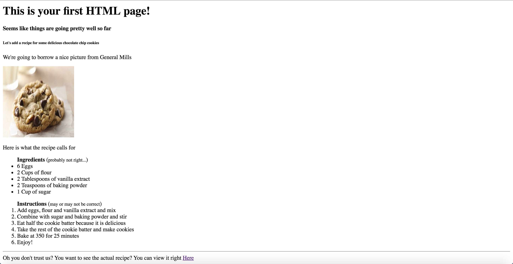

# Exercise:
### In this execise you are supposed to create a page looks like the one in the image below.


## Steps:
- open visual stadio text editor
- create a file called ```index.html```
- start analysing image content and choose the correct tags.
- install ```open in browser``` extension
  - go to extensions in visual studio
  - type name of extension
  - press on ```install```
- right click on your ```index.html``` file and click ```open in other browsers``` and choose your browser
